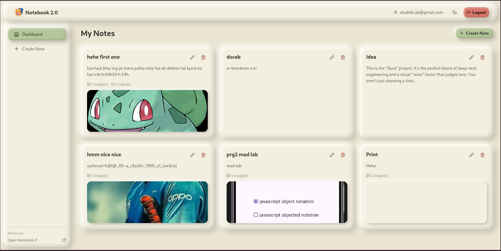
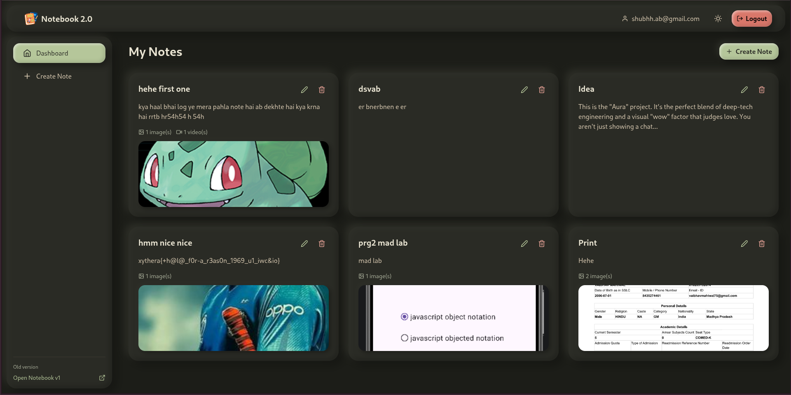
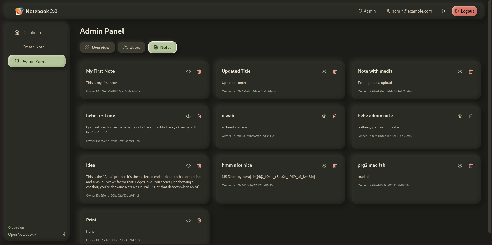
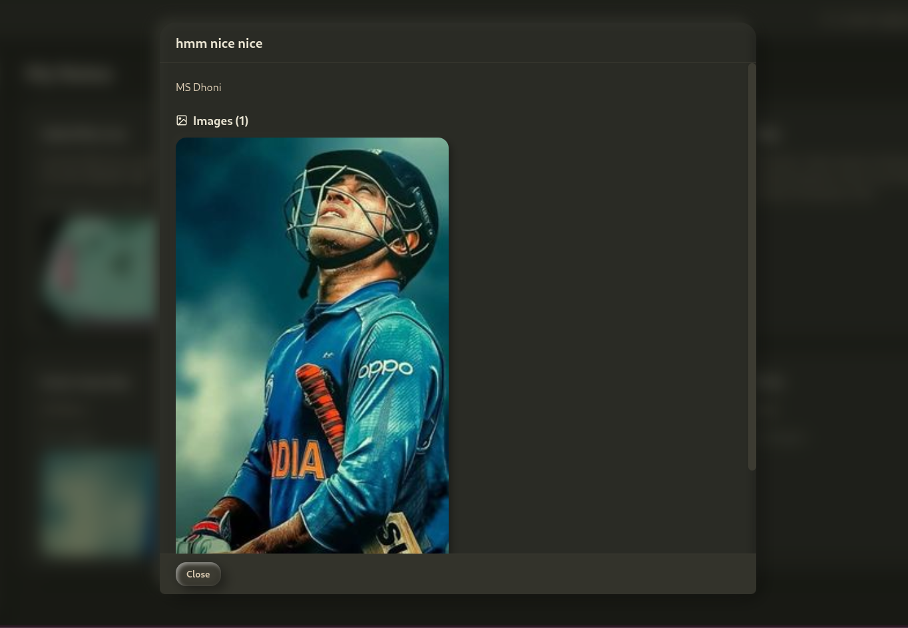
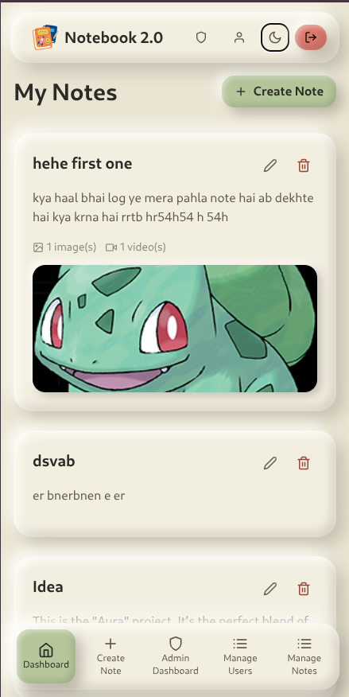
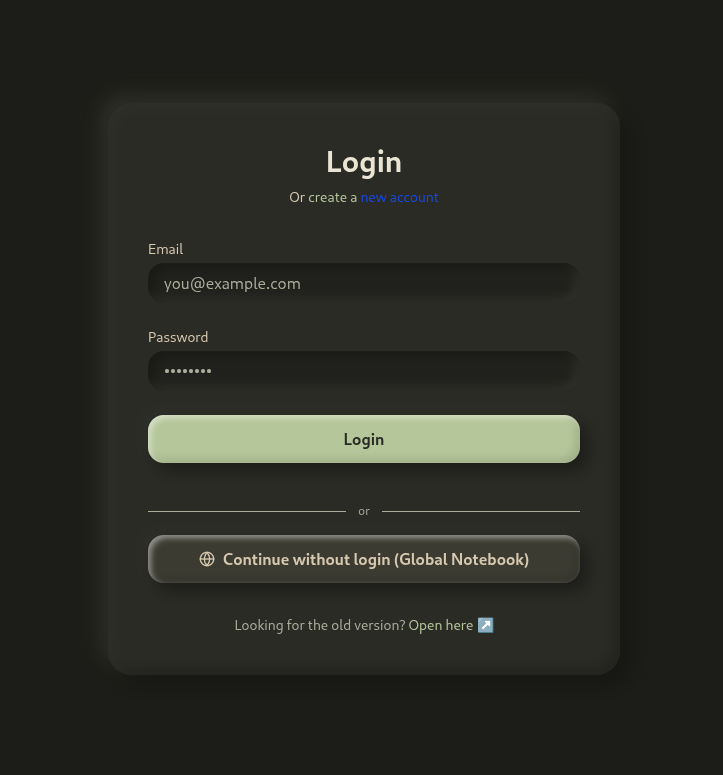

# Notebook 2.0

**A fast, secure, full-stack notes app with image and video attachments.**
Clay-style UI · light & dark mode · JWT auth · admin panel

[**Live demo →** https://notebook2.shubhh.xyz/](https://notebook2.shubhh.xyz/)

      

---

## Screenshots

|                    Dashboard (light)                    |                    Dashboard (dark)                    |                 Admin panel                |
|---|---|---|
|  |  |  |

|               Note preview               |             Mobile             |                Login                |
|---|---|---|
|  |  |  |

## What it does

- **Notes with media**: create, edit and delete notes with images and videos (full-screen viewer included)
- **Secure accounts**: JWT login, Argon2 password hashing, rate-limited auth
- **Global notebook**: one click to try the app as a guest, no sign-up
- **Admin panel**: stats, user and note management with safety guards
- **Looks and feels good**: responsive layout, light/dark theme, smooth animations

## How it fits together

```
React + Vite (Vercel)  ──HTTPS / JWT──▶  FastAPI (Render, Docker)  ──▶  MongoDB Atlas
                                                  └──────────────▶  Cloudinary (media)
```

|      | Folder                             | Highlights                                                                   |
|---|---|---|
| 🎨   | [`frontend/`](frontend/README.md) | React 19, Tailwind v4 design tokens, dark mode, instant page loads via cache |
| ⚙️ | [`backend/`](backend/README.md)   | Async FastAPI, layered architecture, 25 tests (92% coverage), CI, Docker     |

## Run it locally

```bash
# 1. Backend  (needs MongoDB + Cloudinary keys, see backend/.env.example)
cd backend && cp .env.example .env && pip install -r requirements-dev.txt
uvicorn app.main:app --reload            # → http://localhost:8000/docs

# 2. Frontend
cd frontend && npm install
echo "VITE_API_URL=http://localhost:8000/api/v1" > .env
npm run dev                              # → http://localhost:3000
```

Prefer containers? `cd backend && docker compose up --build` starts the API with its own MongoDB.

## Author

Built by [@swaraj-shubh](https://github.com/swaraj-shubh)
